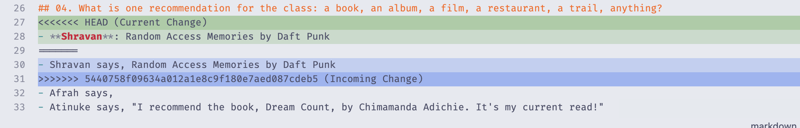
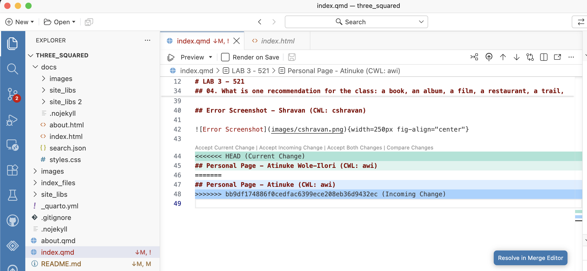
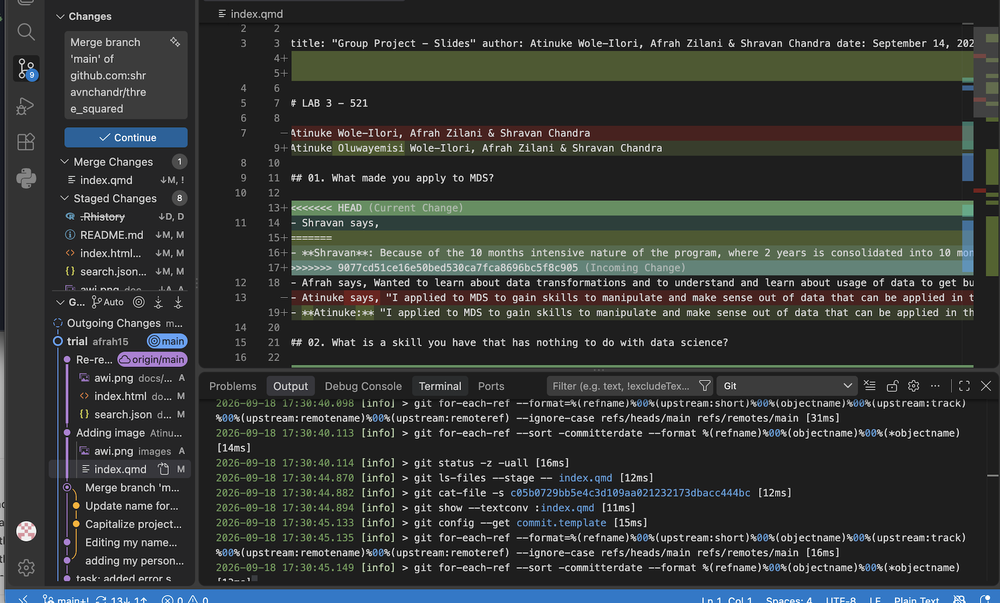

----

title: "Group Project - Slides" 
author: Atinuke Wole-Ilori, Afrah Zilani & Shravan Chandra 
date: September 14, 2026 
output: revealjs::revealjs_presentation

---

# LAB 3 - 521

Atinuke Oluwayemisi Wole-Ilori, Afrah Zilani & Shravan Chandra

## 01. What made you apply to MDS?

- **Shravan**: Because of the 10 months intensive nature of the program, where 2 years is consolidated into 10 months
- **Afrah says,** Wanted to learn about data transformations and to understand and learn about usage of data to get business insights.
- **Atinuke:** "I applied to MDS to gain skills to manipulate and make sense out of data that can be applied in the real world!"

## 02. What is a skill you have that has nothing to do with data science?

- **Shravan**: traveling, cooking, exploring
- **Afrah says**, I can play 8 ball pool and Table tennis.
- **Atinuke:** "I'm able to play multiple musical instruments!"

## 03. What is the first piece of code you ever wrote, and what did it do?

- **Shravan**: sudoku solver with my friend in first year of undergrad
- **Afrah says,** The first piece of code I wrote was in C language "Hello Afrah".
- **Atinuke:** "The first piece of code I ever wrote was a print with Hello World! which simply printed Hello World"

## 04. What is one recommendation for the class: a book, an album, a film, a restaurant, a trail, anything?

- **Shravan**: Random Access Memories by Daft Punk
- **Afrah says**, Atomic Habits, book is must read
- **Atinuke:** "I recommend the Asa album by Asa on a nice rainy day."

## Error Screenshot - Shravan (CWL: cshravan)

{width="250px" fig-align="center"}

## Personal Page - Atinuke Wole-Ilori (CWL: awi)

{width="250px" fig-align="center"}

## Error Screenshot - Afrah (CWL: afrahz)

{width="250px" fig-align="center"}
